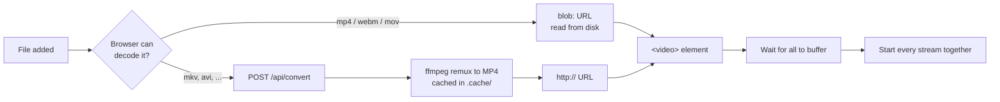

# Architecture

A browser video wall. It plays many local videos side by side, keeps them on the
same timestamp, and measures the frame rate each one actually achieves.

There is no framework and no build step. Three static files run in the browser,
one Python script serves them.

| File | Role |
| --- | --- |
| `index.html` | Layout: toolbar, transport bar, metric cards, video grid, stats table |
| `styles.css` | All styling, including tile sizing |
| `app.js` | Everything dynamic: loading, sync, metrics, grid interaction |
| `server.py` | Serves the page, converts files the browser cannot decode |
| `prepare.sh` | Optional: convert a whole folder up front instead of on drop |

## How a video reaches the screen

Playback is plain HTTP progressive download of an MP4, decoded natively by the
browser. No HLS, DASH, WebRTC, or MSE.

## The four things `app.js` does

### 1. Prepare sources

Browsers reliably decode only MP4, WebM, and MOV. Anything else is sent to the
server, remuxed to MP4, and cached. The remux copies the compressed video
through untouched, so it is fast and lossless.

Detection uses a file-extension allowlist, not `canPlayType()`, because
Chromium answers `"maybe"` for Matroska and then fails to decode it.

### 2. Keep streams in sync

Every 200 ms the sync engine takes the **median** timestamp of all streams as
the reference clock (a median stops one lagging stream from dragging the group),
then corrects each stream:

| Drift from reference | Action |
| --- | --- |
| under 20 ms | leave alone |
| 20 ms to 500 ms | trim playback rate up to ±8% so it converges without stutter |
| over 500 ms | seek, because trimming would take too long |

Seeking mid-playback causes a visible stall, so it is the last resort.

Looping is driven here too: when one stream ends, all are restarted together.
A stream the browser stalls out of playback is resumed automatically, unless
the user paused on purpose.

### 3. Measure real frame rates

`requestVideoFrameCallback` fires once per frame actually shown, giving a
presented-frame count and the media timestamp. From those:

- **Render FPS** — presented frames per second, sampled every 500 ms.
- **Source FPS** — median gap between frames, inverted.
- **Skipped frames** — a gap wider than one source frame means frames were never
  shown. The browser's own `droppedVideoFrames` counter is not used; it reported
  97% dropped while a stream rendered a perfect 30 fps.
- **Min FPS** — the slowest stream right now, and the worst seen all session.
  The session low only updates once every stream is playing, so start-up does
  not pin it to zero.

### 4. Arrange the grid

Each tile takes its own video's aspect ratio, so the picture fills it with no
black bars. Tiles fill the full column width; **Fit all** instead shrinks them
so every stream is on screen without scrolling.

Reordering uses pointer events, not HTML5 drag-and-drop, because the `<video>`
element swallows the native drag gesture. The move is committed on release —
reordering continuously during the drag reshuffles every tile the cursor passes.

## What `server.py` does

A static file server with two additions.

**Range requests.** Python's stock handler ignores `Range` and always sends the
whole file from byte 0, so a browser cannot seek and must download everything
before playing. The handler answers `206 Partial Content`, which is what makes
scrubbing a 500 MB file instant.

**Conversion.** `POST /api/convert` streams the upload to a temp file, remuxes
it with `ffmpeg -c copy`, and caches the result under `.cache/` named by content
hash, so re-adding the same file is free.

**Multiple ports.** A browser allows only ~6 connections per origin, and a
playing `<video>` holds one for its whole life, so 12 tiles on one port starve.
The server listens on 5 consecutive ports and `/api/health` advertises them. The
client checks which ones answer before using them, because a port-forward or
container may expose only the first.

## Limits

| Limit | Value |
| --- | --- |
| Decode throughput | ~500 megapixels/sec total, measured. 8x1080p30 works; 12x1080p30 collapses |
| Concurrent HTTP streams | ~6 per port, ~30 across the 5 ports |
| Tile size cost | Larger tiles cost more compositing: 7 streams ran 13.6 fps at 600 px tiles, 24 fps at 359 px |

Stream count is rarely the limit; total pixels per second is.
